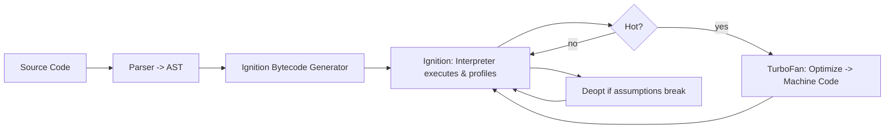

# README.md — How Node.js Runs Internally & Deep Dive into V8

> Comprehensive technical explanation of how Node.js executes JavaScript under the hood, how the V8 engine works, and a behind-the-scenes look at the compiler and runtime pipeline.

---

## Table of Contents

1. High-level Node.js architecture
2. Node process startup: step-by-step lifecycle
3. How Node executes JavaScript code (compilation → execution pipeline)
4. V8 engine internals (detailed)
5. Garbage collection in V8
6. Libuv and the Event Loop — deep internals
7. Module loading and execution model (CJS & ESM)
8. Threads, threadpool, workers, and native addons
9. Typical execution flow — diagrams
10. Profiling, tracing and flags (practical debugging pointers)


## 1. High-level Node.js architecture

At a glance, Node.js consists of several cooperating layers:

* **V8** — Google's JavaScript engine responsible for parsing, compiling, optimizing, executing JS and providing JS primitives and internal garbage collector.
* **libuv** — a C library that provides the event loop, cross-platform asynchronous I/O (epoll/kqueue/IOCP), timers, DNS, threadpool for blocking tasks, etc.
* **Node C++ core** — glue code and native implementations of Node APIs (fs, http, net, timers, process, etc.) that call into libuv or V8 where appropriate.
* **JavaScript user code & built-in JS modules** — code you write that runs inside a V8 *Context* and interacts with Node-provided global objects.
* **Native addons / N-API** — optional binaries compiled in C/C++ that link into Node and V8 for performance or native access.

Conceptually:

`Your JS code` ↔ **V8** ↔ **Node C++ APIs** ↔ **libuv / OS kernel**

---

## 2. Node process startup: step-by-step lifecycle

1. **Process invoked** via `node script.js` (or `node -e '...'`).
2. **Native bootstrap** (C++): Node initializes internal data structures, parses CLI flags, initializes libuv (`uv_loop_t`).
3. **Create a V8 Isolate** — an isolated instance of the V8 engine which contains its own heap and execution state.
4. **Create a V8 Context** — an execution environment with its own global object and builtins.
5. **Load snapshot** (if available) — a serialized heap snapshot containing pre-initialized builtin objects and compiled code to speed startup.
6. **Initialize Node bootstrap code** — bindings for `process`, `global`, `require`/`import`, builtin modules and internal primordials are set up (some in C++ and some in JS).
7. **Module loader resolves the entry module** (CJS wrapper or ESM loader behavior) and begins executing user code.
8. **Event loop starts** — Node will only exit when there are no more pending events, timers, or handles or when `process.exit()` is called.

---

## 3. How Node executes JavaScript code (compilation → execution pipeline)

V8 does not simply interpret JS text and run it; it uses a multi-tier compilation strategy to balance startup latency and long-term performance.

**Simplified pipeline:**

1. **Parsing** — source code is tokenized and parsed into an **Abstract Syntax Tree (AST)**.
2. **Bytecode generation (Ignition)** — V8's interpreter (Ignition) converts the AST into *bytecode* (a compact, interpreter-friendly representation).
3. **Interpreter execution** — Ignition executes the bytecode and simultaneously collects runtime type feedback and profiling information.
4. **Optimization (TurboFan)** — when functions become "hot" (frequently executed), V8's optimizing compiler (TurboFan) uses the profile to produce highly optimized machine code.
5. **On-Stack Replacement (OSR)** — if a function becomes hot while mid-execution, V8 can patch the running frames to switch from interpreter to optimized code.
6. **Deoptimization** — if an optimized function's assumptions are violated (e.g., different object shapes), V8 can bail out and fall back to the interpreter or recompile with new assumptions.

**Key ideas:**

* V8 favours fast startup (via bytecode + interpreter) and selectively invests CPU to optimize hot code.
* Optimizations rely on runtime assumptions (hidden classes, stable types); when those assumptions break, V8 deoptimizes.

---

## 4. V8 engine internals (detailed)

V8 is a complex system with many subcomponents. Important ones are:

### a) Isolate & Context

* **Isolate**: independent instance of V8 (separate heap, VM state).
* **Context**: JS global environment within an isolate (multiple contexts can exist in one isolate in advanced embeddings).

### b) Parser & AST

* V8 tokenizes JS source, performs early syntax checks and builds an AST representing program structure.

### c) Ignition — the bytecode interpreter

* Produces bytecode from AST.
* Bytecode is compact and designed for efficient interpretation and profiling.
* Ignition executes bytecode while collecting type feedback and calling V8 runtime stubs for operations.

### d) TurboFan — the optimizing compiler

* Takes an intermediate representation (IR) based on profiling from Ignition.
* Generates machine code heavily optimized for current patterns: inline caching, specialized arithmetic, inlined functions, etc.
* Produces tiered machine code: functions may run in baseline/interpreted mode first, later upgraded.

### e) Inline Caches & Hidden Classes

* **Hidden classes (maps)**: V8 creates internal shapes for objects so properties can be accessed as fixed offsets.
* **Inline caches (ICs)**: initially polymorphic caches that accelerate property lookup paths; when stable, they become monomorphic and very fast.

### f) Runtime calls and C++ boundary

* V8 code often calls into C++ runtime stubs for complex operations.
* Node binds native (C++) functions to JS through the V8 API or N-API. Those native functions can in turn use libuv for async work.

### g) Snapshots

* A snapshot is a serialized heap image that contains pre-created builtin objects and bytecode to reduce initialization cost.
* Node and Chromium use snapshots to accelerate process startup.

---

## 5. Garbage collection in V8

V8 uses a **generational garbage collector** with multiple components:

* **New (young) space** — small, frequent allocations. Collected by a copying collector called the **Scavenger** (semi-space copying). Fast for short-lived objects.
* **Old (tenured) space** — objects that survive young collections are promoted here. Collected by **Mark-Sweep & Mark-Compact** algorithms.
* **Large Object Space (LOS)** — for large allocations; handled differently.

**GC Phases / Techniques:**

* **Scavenge**: copy live objects from `from-space` to `to-space` in the young generation.
* **Marking**: mark live objects in old generation.
* **Sweeping/Compaction**: free memory and optionally compact to reduce fragmentation.
* **Incremental & Concurrent GC**: V8 attempts to do marking concurrently (and incremental marking) to minimize pause times. Sweeping/compaction can be done in background threads.

**Practical consequences:**

* Short-lived objects are cheap. Reusing objects and avoiding unnecessary allocations reduces GC pressure.
* Large object churn and long-lived allocations in old space can cause longer GC pauses and fragmentation.

---

## 6. Libuv and the Event Loop — deep internals

`libuv` is the asynchronous I/O backbone of Node and implements a platform-independent event loop.

### a) Kernel-level mechanisms

* On Linux: **epoll**; macOS/BSD: **kqueue**; Windows: **IOCP**.
* libuv uses these to be notified when file descriptors are readable/writable, when timers expire, etc.

### b) libuv `uv_loop_t` phases (conceptual ordering)

Node's event loop is built on libuv and has phases (conceptual behavior):

1. **timers** — callbacks for expired `setTimeout`/`setInterval`.
2. **pending callbacks** — certain system callbacks.
3. **idle/prepare** — internal use.
4. **poll** — fetch I/O events; execute callbacks for I/O.
5. **check** — callbacks scheduled by `setImmediate`.
6. **close callbacks** — e.g. socket `close` events.

### c) Queues inside Node

* **nextTick queue** (`process.nextTick`) — special queue executed immediately after the current operation before yielding to the event loop phases. It has higher priority than Promise microtasks.
* **microtask queue** — Promise jobs and other microtasks; processed after the current macrotask and usually after the nextTick queue.
* **timers / poll / check callbacks** — macrotasks processed by the event loop phases.

**Order notes:**

* After executing a callback from a phase, Node drains the `nextTick` queue fully, then the microtask (Promise) queue, before continuing the event loop. (This ordering gives `process.nextTick` the ability to starve I/O if abused.)

### d) Threadpool

* libuv maintains a threadpool (default size 4) used for operations that are not natively async on all platforms (e.g., some file system operations, DNS resolution when not using the non-blocking resolver, user-scheduled `uv_queue_work` tasks). These tasks run on worker threads and post results back to the loop.

### e) I/O callbacks

* Async I/O is implemented by submitting interest in FD events to the kernel. The kernel signals readiness and libuv calls the registered C callback, which eventually triggers a JS callback inside V8.

---

## 7. Module loading and execution model (CJS & ESM)

### CommonJS (require)

* Node wraps each module in a function wrapper to provide `require`, `exports`, `module`, `__filename`, `__dirname`.
* Modules are cached after first load (`require.cache`) to avoid re-evaluation.
* Loading is synchronous from the application's perspective.

### ECMAScript Modules (ESM)

* ESM uses a spec-compliant loader that supports static analysis of imports and exports, top-level `await`, and deferred evaluation semantics.
* ESM resolution is asynchronous and allows cyclic imports with precise semantics.

**Execution model**

* JS execution is **run-to-completion**: once a JS callback starts executing on the main thread, it runs until it either returns or calls into async APIs. Microtasks and `process.nextTick` are drained between tasks but not during a running JS function.

---

## 8. Threads, threadpool, workers, and native addons

### Worker Threads

* Node supports `worker_threads` which spawn separate V8 isolates (with their own thread and heap). Communication is via message passing (structured clone) or SharedArrayBuffer.

### Threadpool

* The libuv threadpool handles blocking work and runs callbacks back on the loop thread.

### Native Addons

* Addons can be built with **N-API** (stable ABI) or older V8 APIs / NAN. Addons run in-process and can call V8 APIs directly or schedule asynchronous work with libuv.

---

## 9. Typical execution flow — diagrams

### A. Process & runtime flow (Mermaid-style flowchart)

```mermaid
flowchart TD
  A[Start: node script.js] --> B{Parse CLI & init libuv}
  B --> C[Create V8 Isolate & Context]
  C --> D[Load Snapshot & Init Builtins]
  D --> E[Module Loader resolves entry module]
  E --> F[Compile (parse -> bytecode)]
  F --> G[Ignition executes bytecode]
  G --> H{Function hot?}
  H -- yes --> I[TurboFan compiles optimized code]
  I --> G
  H -- no --> G
  G --> J[Schedule async tasks (timers, I/O)]
  J --> K[libuv event loop processes events]
  K --> L[Invoke JS callbacks in V8]
  L --> M[Drain nextTick / microtask queues]
  M --> K
  K --> N[Exit when no handles]
```

### B. V8 compilation pipeline (ASCII / mermaid)




